# 昇腾 310B 手势识别智能控制系统

本课设作品以 **昇腾 310B / OrangePi AI 开发板** 作为手势识别主机，以 **STM32F103C8T6** 作为外设控制从机，完成了一套可以通过手势完成身份认证、菜单选择、电机调速、舵机门控、RFID 卡片录入以及密码修改的智能控制系统。

作品的核心体验是：用户面对摄像头做出指定手势，主机端识别手势标签后将控制指令发送给 STM32，从机端在屏幕上显示当前页面和操作结果，并控制风扇、电机、舵机门锁、RFID 模块等硬件完成对应动作。

  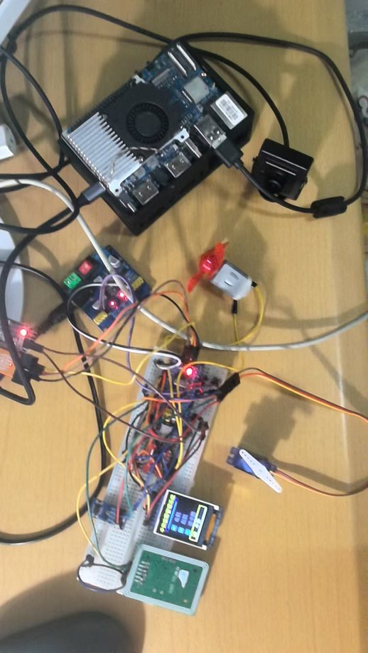

## 一、作品功能总览

本系统围绕“手势识别 + 智能控制 + 安全认证”设计，主要功能如下：

| 功能模块 | 功能说明 | 实物表现 |
| --- | --- | --- |
| 手势密码解锁 | 上电进入锁屏页面，用户依次做出 4 位手势密码，默认密码为 `1-2-3-4`，识别正确后进入主菜单。 | 屏幕显示锁屏输入状态，解锁成功后切换到首页。 |
| 首页菜单选择 | 解锁后进入首页，使用数字手势 `1/2/3/4` 选择电机、舵机、RFID 录入、手势录入功能，再用 `like` 或 `ok` 确认进入。 | 屏幕高亮当前选中的功能菜单。 |
| 电机 / 风扇控制 | 在电机页面中，数字手势 `0/1/2/3` 分别对应停止、一档、二档、三档。 | 风扇转速随手势档位变化，屏幕同步显示当前档位。 |
| 舵机门控 | 在舵机页面中，`palm` 打开舵机门，`fist/grip` 关闭舵机门，退出页面时自动关门。 | 舵机带动门锁结构完成开门、关门动作。 |
| RFID 卡片录入与认证 | 可在 RFID 页面录入门禁卡；锁屏状态下刷已录入卡片可直接解锁。 | 屏幕提示录入过程和认证结果。 |
| 手势密码修改 | 进入手势录入页面后，逐位录入新的 4 位手势密码，保存后下次解锁生效。 | 屏幕显示当前录入位、倒计时和保存结果。 |
| 掉电保存 | RFID 卡号和手势密码保存到 AT24C02，断电重启后仍能保留。 | 修改后的卡片和密码重启后仍可使用。 |
| 安全锁定 | 密码或卡片认证连续失败达到限制后，系统进入短时间锁定。 | 屏幕进入锁定提示，等待倒计时结束后才可继续尝试。 |

## 二、系统实物效果

整个作品由 AI 识别端、STM32 控制端和外设执行端组成。AI 开发板负责识别摄像头中的手势，STM32 负责显示页面、接收串口命令并驱动具体硬件。

  

实物中可以看到屏幕、舵机门控结构、RFID 模块、电机 / 风扇模块等硬件被集中到同一套控制系统中。用户不需要按键操作，只需要通过手势或 RFID 卡片即可完成身份认证与设备控制。

## 三、手势标签与控制含义

模型识别到的并不是简单的“1、2、3、4、5”，而是具体的手势标签。系统会把这些标签转换成 STM32 能理解的控制命令。下面整理了本作品实际用到的 9 类手势。

| 手势图片 | 模型识别标签 | 发送命令 | 在系统中的作用 |
| --- | --- | --- | --- |
| 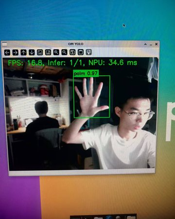 | `fist` / `grip` | `0` | 数字 0；电机停止；舵机页面中执行关门。 |
| 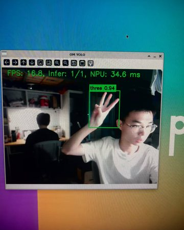 | `one` | `1` | 数字 1；首页选择电机功能；电机页面中切换一档。 |
| 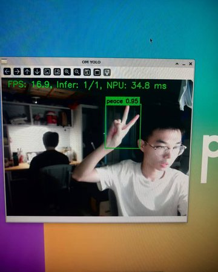 | `two_up` / `peace` / `peace_inverted` | `2` | 数字 2；首页选择舵机功能；电机页面中切换二档。 |
| 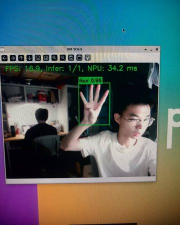 | `three` / `three2` / `three3` | `3` | 数字 3；首页选择 RFID 录入功能；电机页面中切换三档。 |
| 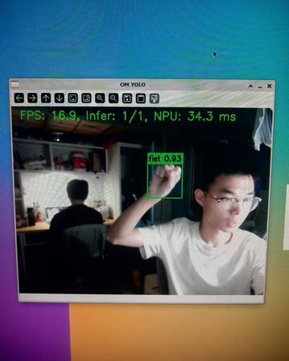 | `four` | `4` | 数字 4；首页选择手势密码录入功能。 |
| 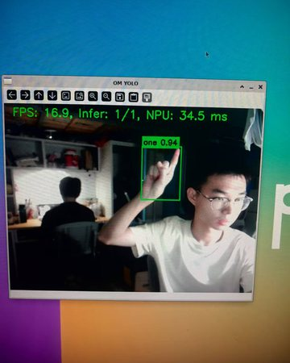 | `palm` | `5` | 数字 5；舵机页面中执行开门。 |
| 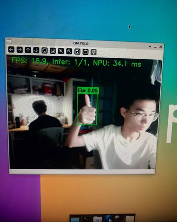 | `like` | `like` | 确认、进入当前菜单、开始当前位手势录入。 |
| 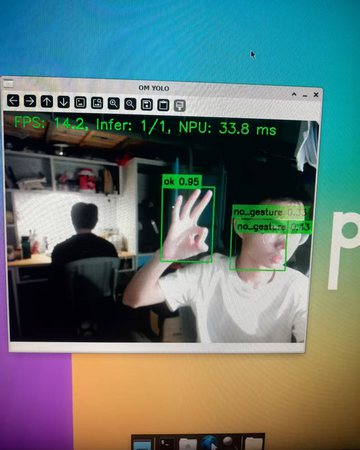 | `ok` | `ok` | 确认、进入当前菜单、开始当前位手势录入。 |
| 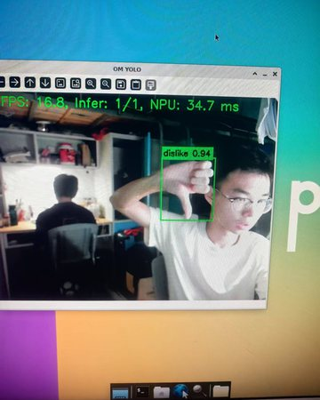 | `dislike` | `dislike` | 返回上一级；在首页执行退出登录并回到锁屏。 |

其中 `stop`、`stop_inverted` 也会被系统识别为停止类命令；`fist` 和 `grip` 在本作品中统一作为数字 `0` 和关闭动作使用。

## 四、完整使用流程

系统的操作逻辑按照“先认证、再选择、再控制”的方式展开：

1. **上电进入锁屏页**：屏幕显示密码输入界面，等待手势密码或 RFID 卡认证。
2. **完成身份认证**：默认手势密码为 `one → two_up / peace → three → four`，也就是数字 `1-2-3-4`；刷入已录入的 RFID 卡也可以解锁。
3. **进入首页菜单**：解锁后显示 4 个功能入口，使用数字手势选择菜单项。
4. **确认进入功能页**：做出 `like` 或 `ok` 手势后进入当前选中的功能。
5. **执行具体控制**：在不同页面中，同一组手势会对应不同控制含义，例如电机调速、舵机开关门、RFID 录入或密码修改。
6. **返回或退出登录**：在功能页面做出 `dislike` 返回首页；在首页做出 `dislike` 则退出登录，重新回到锁屏页。

## 五、锁屏认证与解锁效果

系统上电后首先进入锁屏页面，防止未认证用户直接控制硬件。用户可以通过两种方式解锁：

- **手势密码解锁**：依次做出 4 位手势密码，默认密码为 `1-2-3-4`。
- **RFID 卡片解锁**：刷已录入的 RFID 卡片，认证成功后直接进入首页。

  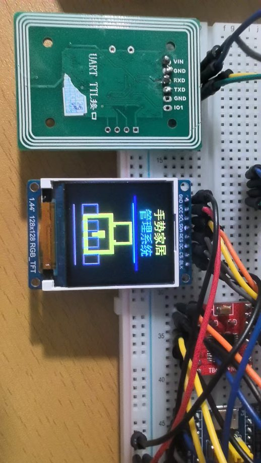
  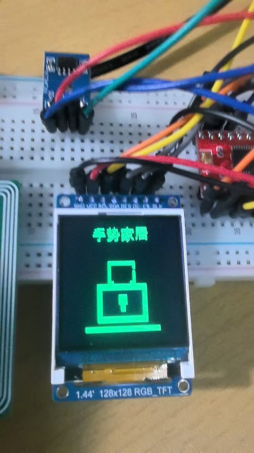

当输入正确时，屏幕会显示解锁成功并进入首页；如果连续认证失败，系统会累计错误次数，达到限制后进入短时间锁定，从而提升门禁控制的安全性。

  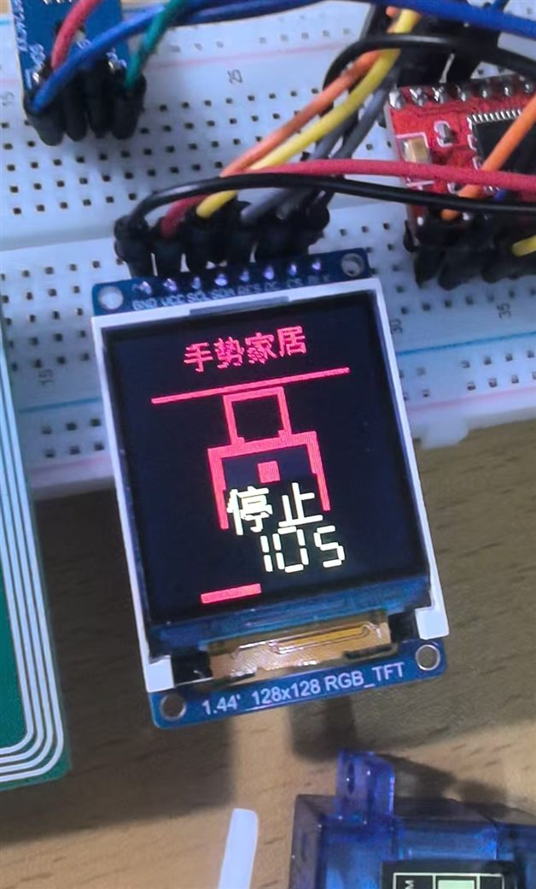
  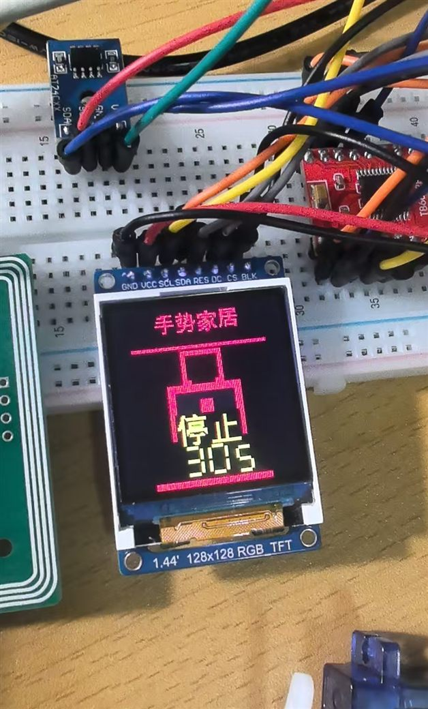

锁定状态下，屏幕会显示“停止”和剩余倒计时，提示用户当前不能继续尝试手势密码或 RFID 刷卡认证。倒计时结束后，系统才重新开放认证入口，这两张实物图展示了安全锁定过程中的不同剩余时间状态，让失败保护机制在答辩演示中更加直观。

## 六、首页菜单与手势导航

解锁成功后，系统进入首页菜单。首页提供 4 个主要功能入口：

| 首页序号 | 手势命令 | 对应功能 |
| --- | --- | --- |
| 1 | `one` | 电机 / 风扇控制 |
| 2 | `two_up` / `peace` | 舵机门控 |
| 3 | `three` | RFID 卡片录入 |
| 4 | `four` | 手势密码修改 |

  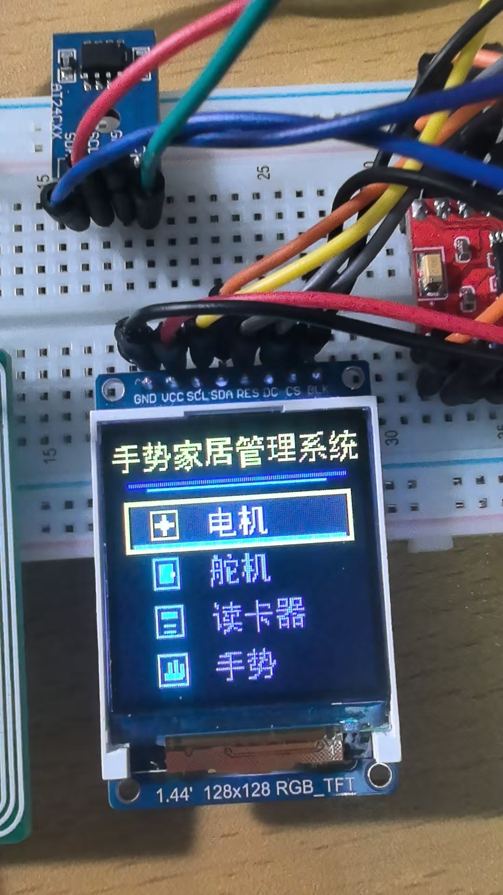

在首页中，数字手势只负责切换当前选中的菜单项；真正进入功能页面需要再做一次 `like` 或 `ok` 手势确认。这样的设计可以减少误触发，避免用户做数字手势时直接进入错误页面。

## 七、电机 / 风扇三档控制

电机页面用于演示手势对执行器的实时控制。进入该页面后，系统会根据识别到的数字手势调整电机 PWM 输出，从而改变风扇转速。

| 手势 | 命令 | 功能效果 |
| --- | --- | --- |
| `fist` / `grip` | `0` | 停止电机 / 风扇 |
| `one` | `1` | 一档低速运行 |
| `two_up` / `peace` | `2` | 二档中速运行 |
| `three` | `3` | 三档高速运行 |

  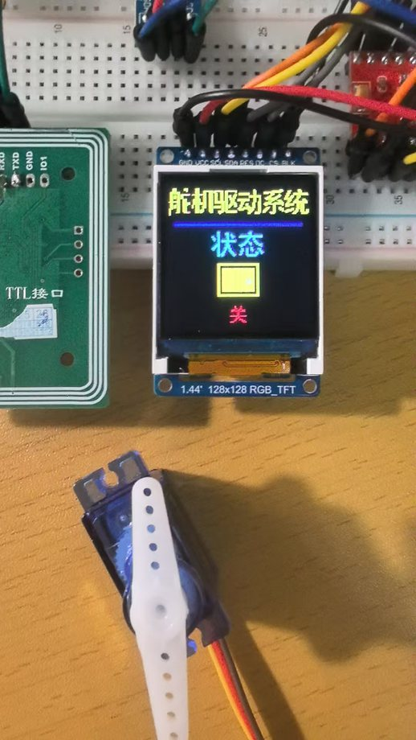
  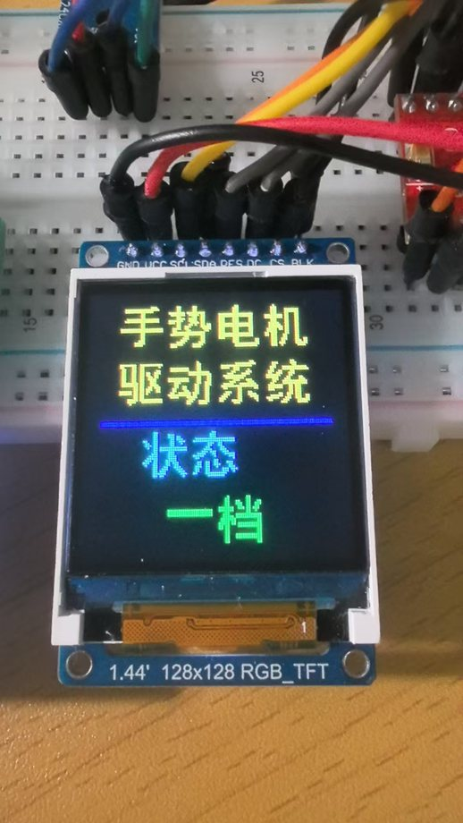
  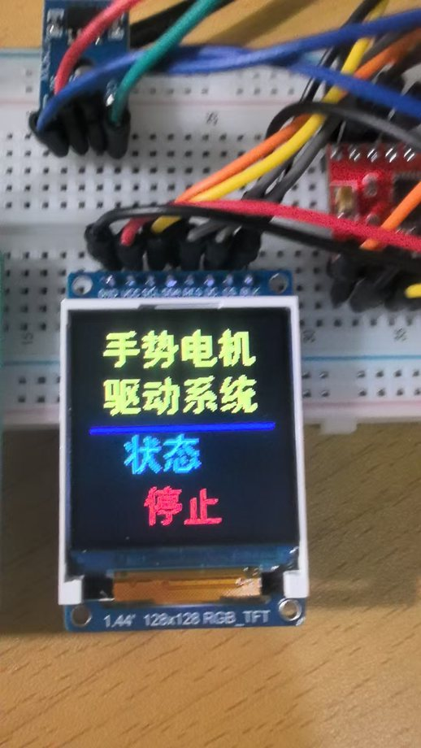
  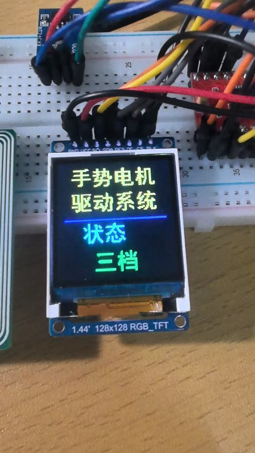

从实物效果上看，屏幕会同步显示当前档位，风扇转速也会随着手势命令变化。退出电机页面时，系统会自动把电机速度清零，避免用户离开页面后电机继续运行。

## 八、舵机门控功能

舵机页面用于模拟智能门锁或小型门禁结构。该页面不再使用 `1/2/3/4` 调速，而是使用开门、关门两个明确动作：

| 手势 | 命令 | 功能效果 |
| --- | --- | --- |
| `palm` | `5` | 舵机打开，模拟开门。 |
| `fist` / `grip` | `0` | 舵机关闭，模拟关门。 |

  
  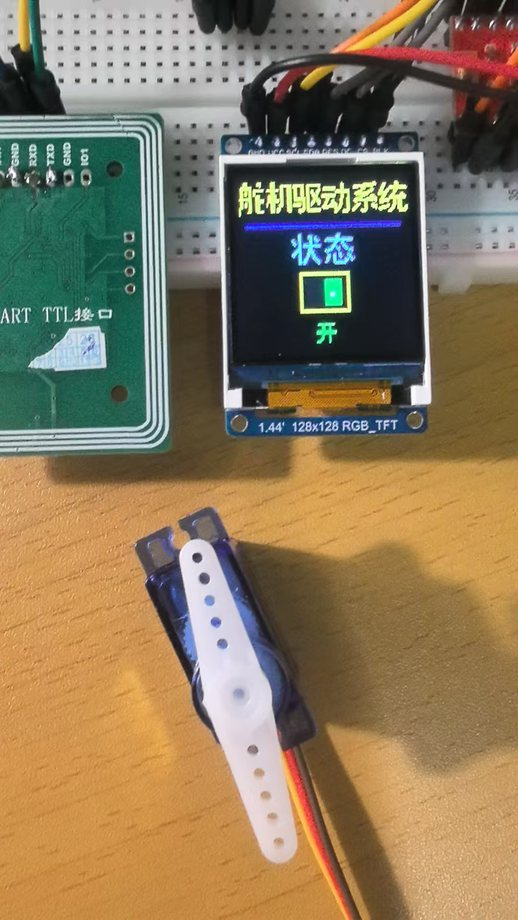

这个功能把“手势识别结果”直接转换成物理动作：用户张开手掌时开门，握拳时关门。为了保证安全，离开舵机页面时系统会自动执行关门动作。

## 九、RFID 卡片录入与刷卡解锁

RFID 页面用于录入门禁卡。进入该页面后，系统提示用户将卡片靠近 RFID 模块，读取成功后会保存卡号。之后在锁屏状态下，用户只需要刷这张卡即可完成身份认证。

  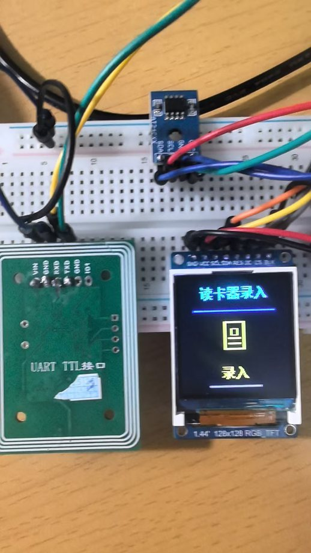
  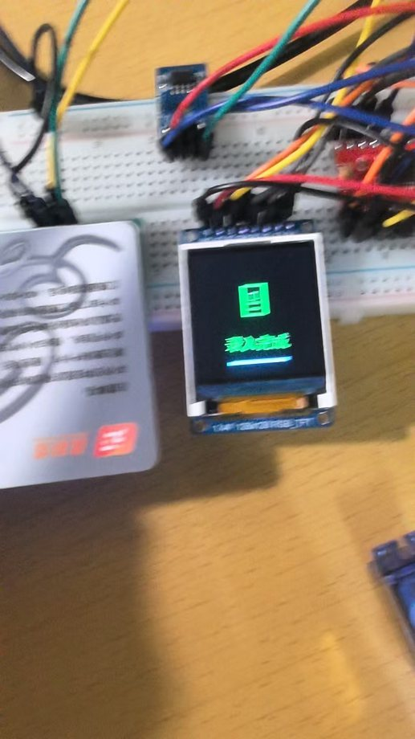

RFID 功能让系统不仅支持“手势密码”，也支持“实体卡片”认证，更接近真实门禁系统的使用方式。刷卡失败时系统会记录失败次数，连续失败后进入锁定状态。

## 十、手势密码修改与记录

手势录入页面用于修改 4 位手势密码。它的操作流程是逐位录入，而不是一次性连续识别：

1. 进入手势录入页面。
2. 对当前位做出 `like` 或 `ok`，开始倒计时。
3. 倒计时结束后做出数字手势 `0~5` 中的一个，作为当前位密码。
4. 系统进入下一位，直到 4 位全部录入完成。
5. 屏幕提示修改成功，新的手势密码被保存。

  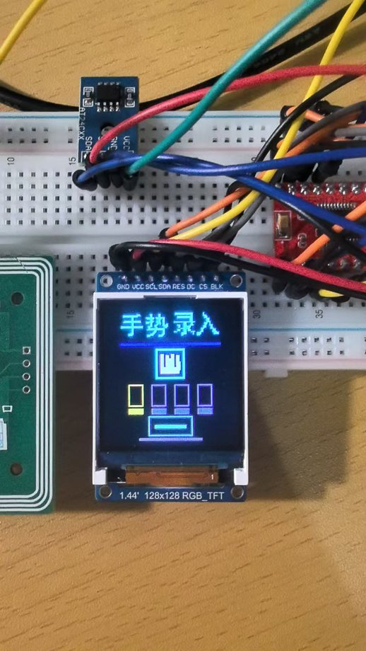
  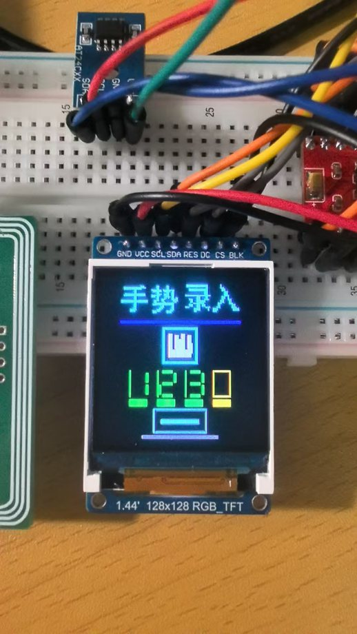
  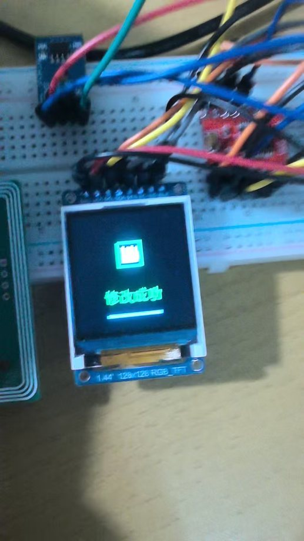

如果录入过程中识别到无效手势或超时，系统会要求重新录入当前位，避免错误手势被写入密码。录入完成后，新的密码会在后续锁屏解锁中生效。

## 十一、掉电保存能力

系统使用外部存储保存关键配置，包括：

- 已录入的 RFID 卡号；
- 用户修改后的 4 位手势密码；
- 数据有效标志、版本和校验信息。

这意味着用户完成 RFID 录入或手势密码修改后，即使系统断电重启，之前保存的认证信息仍然保留，不需要重新设置。

  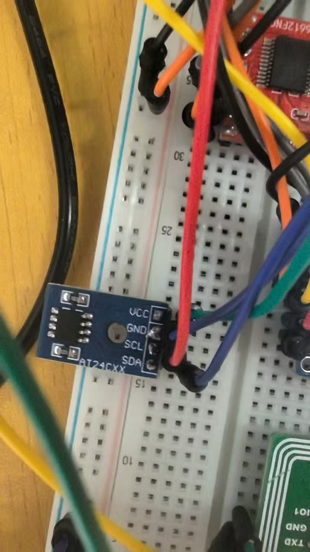

掉电保存让作品从“临时演示”变成了更完整的嵌入式应用：用户设置过的门禁信息能够长期保存，符合实际设备的使用习惯。

## 十二、代码库功能解读

本节只从作品功能角度说明代码库各部分承担的职责，不展开具体实现细节。

| 目录 / 文件 | 功能定位 |
| --- | --- |
| `主机部分/case8/hagrid_yolo` | 负责摄像头画面采集、手势识别、识别结果转换和串口发送，是 AI 手势识别主机端。 |
| `主机部分/case8/hagrid_yolo/stm32_serial.py` | 维护手势标签到控制命令的映射，例如把 `one` 转换为 `1`，把 `palm` 转换为 `5`，把 `like/ok/dislike` 转换为确认或返回命令。 |
| `从机部分/STM32C8T6/Core/Src/main.c` | 负责整套交互状态：锁屏、首页、电机页、舵机页、RFID 录入页、手势录入页之间的切换。 |
| `从机部分/STM32C8T6/App` | 封装屏幕显示、菜单页面、电机、舵机、RFID、AT24C02 等应用层功能。 |
| `从机部分/STM32C8T6/Core/Src` | 保存 STM32 外设初始化和底层驱动调用，使屏幕、串口、定时器、SPI、GPIO 等硬件能够协同工作。 |

从整体关系上看，主机端负责“看懂手势”，从机端负责“执行动作并显示结果”。两部分通过串口命令连接，使 AI 识别结果能够直接驱动真实硬件。

## 十三、作品亮点

- **交互方式直观**：用手势代替按键，用户可以通过自然动作完成选择、确认、退出和设备控制。
- **功能闭环完整**：包含解锁、菜单、执行器控制、RFID 录入、密码修改、掉电保存等完整流程。
- **软硬件结合明显**：AI 开发板负责视觉识别，STM32 负责外设控制，屏幕实时反馈操作状态。
- **安全性设计完善**：支持手势密码和 RFID 双认证方式，并加入失败次数限制和锁定机制。
- **演示效果清晰**：每个功能都有屏幕状态和实物动作对应，适合课设答辩展示。

## 十四、总结

本课设完成了一套基于昇腾 310B 的手势识别智能控制系统。作品不仅能够识别多类手势，还能把识别结果应用到真实硬件控制中，实现从“视觉识别”到“设备动作”的完整链路。

系统最终实现了手势密码解锁、RFID 门禁、首页菜单导航、电机三档调速、舵机开关门、手势密码修改和掉电保存等功能，体现了 AI 视觉识别、嵌入式控制和人机交互在同一作品中的综合应用。
