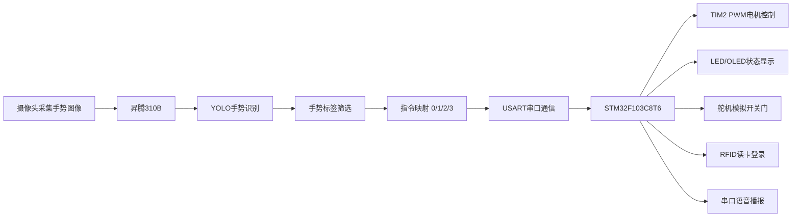
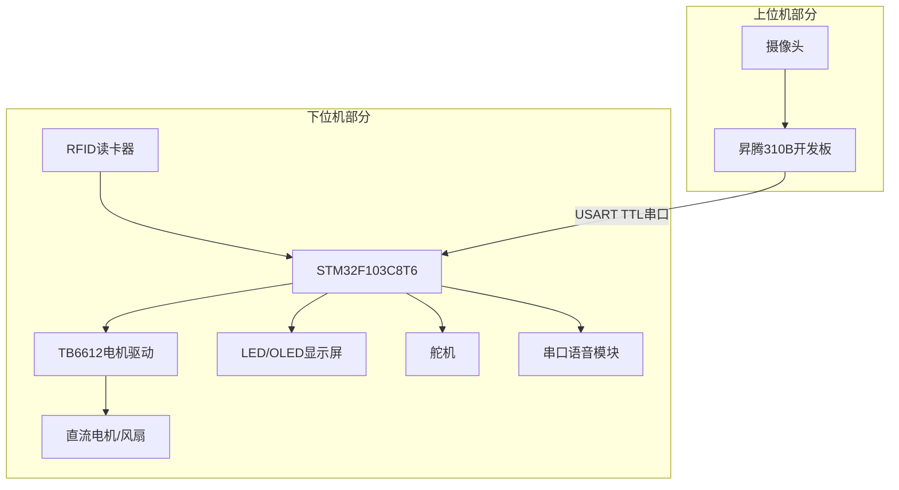
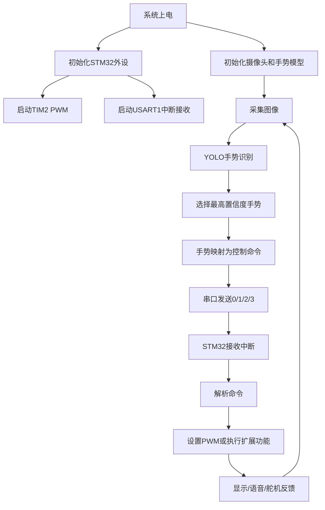
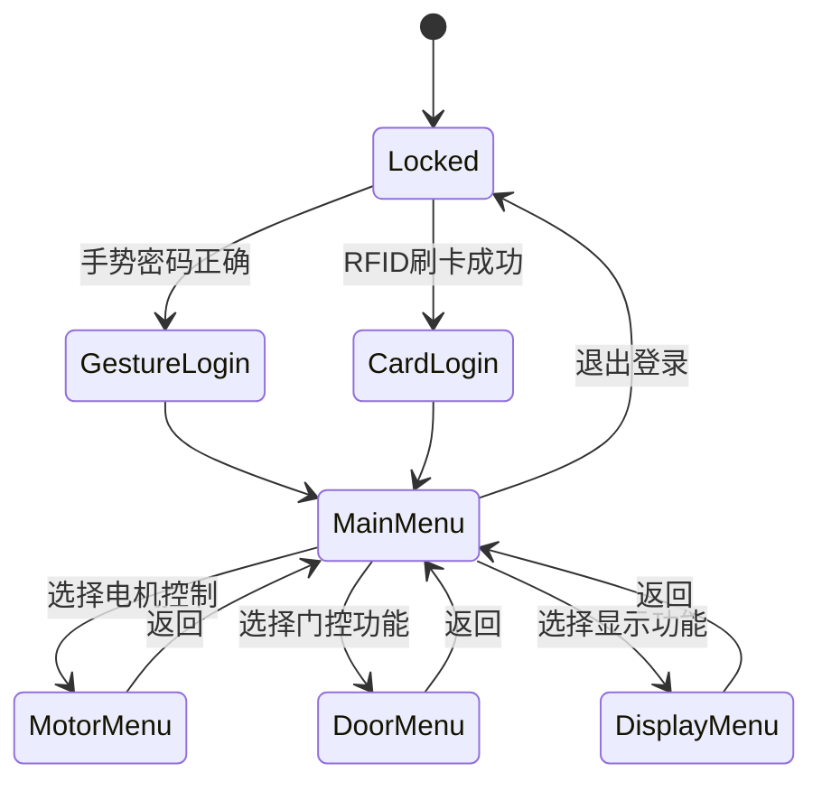

# 昇腾310B手势识别智能控制系统设计文档

| 项目名称 | 昇腾310B手势识别智能控制系统 |
| --- | --- |
| 文档类型 | 系统设计文档 |
| 提交时间 | 2026-07-02 9:00 |
| 小组成员 | 戴新宇 |
| 项目形态 | 昇腾310B视觉识别 + STM32下位机控制 + 电机/显示/门禁扩展 |
| 当前阶段 | 基础手势控制电机功能已完成并跑通，后续进入创新功能扩展阶段 |

## 1. 项目概述

本项目面向无接触智能交互场景，采用“上位机AI识别 + 下位机实时控制”的系统结构。昇腾310B开发板负责摄像头图像采集、YOLO手势识别、手势结果解析和控制指令生成；STM32F103C8T6最小系统板负责串口指令接收、电机PWM控制以及后续LED屏幕、舵机、读卡器、语音模块等外设扩展。

当前基础功能已经完成：上位机识别手势后，通过串口向STM32发送`0`、`1`、`2`、`3`四个ASCII控制指令；STM32通过USART1中断接收指令，并将TIM2_CH1输出PWM分别设置为`0`、`300`、`600`、`999`，实现电机停止、低速、中速、高速控制。Keil工程已经完成构建验证，基础手势控制电机闭环已经跑通。

后续创新方向是在基础电机控制之外，增加LED/OLED显示屏用于显示识别结果、系统菜单和登录状态；使用手势控制LED菜单；设计手势密码登录；可选接入RFID读卡器作为身份认证方式；登录成功后通过手势控制LED显示、电机、舵机模拟开关门，并接入串口语音播放模块播报对应功能状态，形成一个“AI手势识别 + 身份认证 + 智能门禁/设备控制”的综合小系统。

## 2. 物料到位情况

目前项目所需基础物料和后续创新扩展物料均已具备，可满足基础功能验证和后续创新开发需求。当前未发现影响项目推进的未到货物料。

### 2.1 已到货物料清单与实物核对

| 序号 | 物料名称 | 数量 | 用途 | 到位情况 | 实物核对情况 |
| --- | --- | ---: | --- | --- | --- |
| 1 | 昇腾310B开发板 | 1 | 运行手势识别模型，生成控制指令 | 已到货 | 已核对，可作为上位AI识别平台 |
| 2 | 摄像头模块 | 1 | 采集手势图像或视频流 | 已到货 | 已核对，用于实时识别输入 |
| 3 | STM32F103C8T6最小系统板 | 1 | 下位机控制核心 | 已到货 | 已核对，USART1、TIM2、GPIO已配置 |
| 4 | TB6612电机驱动模块 | 1 | 驱动直流电机或风扇，隔离单片机IO与负载 | 已到货 | 已核对，已用于PWM控制测试 |
| 5 | 直流电机/风扇 | 1 | 基础执行器，展示不同PWM档位 | 已到货 | 已核对，基础手势控制已跑通 |
| 6 | LED/OLED显示屏模块 | 1 | 显示手势结果、菜单、登录状态 | 已到货 | 已核对，后续接入显示系统 |
| 7 | 舵机 | 1 | 模拟门锁或门体开关动作 | 已到货 | 已核对，后续接入门控功能 |
| 8 | RFID读卡器模块 | 1 | 可选身份认证方式 | 已到货 | 已核对，后续用于刷卡登录 |
| 9 | 串口语音播放模块 | 1 | 播报登录、开门、档位变化等状态 | 已到货 | 已核对，后续通过UART控制播放 |
| 10 | 杜邦线、面包板、电源线等 | 若干 | 模块连接和调试 | 已到货 | 已核对，满足当前连线需求 |
| 11 | 5V电源/USB供电线 | 若干 | 为开发板、外设和执行器供电 | 已到货 | 已核对，后续需按负载分路供电 |

### 2.2 未到货物料与预计到位时间

| 物料 | 当前状态 | 预计到位时间 | 说明 |
| --- | --- | --- | --- |
| 无 | 不适用 | 不适用 | 当前基础功能和计划创新功能所需设备均已具备 |

## 3. 系统方案设计

### 3.1 系统总体架构

系统分为上位机识别层、通信协议层、下位机控制层和外设执行层。

- 上位机识别层：昇腾310B运行HaGRID/YOLO手势识别程序，完成摄像头采集、模型推理、检测结果筛选和手势标签输出。
- 通信协议层：上位机将手势标签映射为简单ASCII指令，通过串口发送给STM32。当前协议为单字节命令`0/1/2/3`。
- 下位机控制层：STM32通过USART1中断接收命令，解析后控制PWM和GPIO；后续扩展菜单状态机、登录状态机和多个外设驱动。
- 外设执行层：当前执行器为电机/风扇，后续增加LED/OLED屏幕、舵机门控、RFID读卡器、语音播放模块。



### 3.2 当前基础闭环

当前已完成的基础闭环如下：

1. 摄像头采集手势画面。
2. 昇腾310B运行`YOLOv10n_gestures.om`等手势识别模型。
3. 上位机从检测结果中选择置信度最高的手势标签。
4. `stm32_serial.py`将手势标签映射为`0/1/2/3`单字节命令。
5. STM32通过USART1接收命令。
6. STM32修改TIM2_CH1比较值，改变电机PWM占空比。

当前命令映射如下：

| 上位机发送指令 | STM32 PWM值 | 电机状态 |
| --- | ---: | --- |
| `0` | 0 | 停止 |
| `1` | 300 | 低速 |
| `2` | 600 | 中速 |
| `3` | 999 | 高速 |

当前上位机手势映射示例：

| 手势标签 | 发送指令 | 执行动作 |
| --- | --- | --- |
| `stop`、`stop_inverted`、`palm` | `0` | 电机停止 |
| `one` | `1` | 低速运行 |
| `two_up`、`peace`、`peace_inverted` | `2` | 中速运行 |
| `three`、`three2`、`three3` | `3` | 高速运行 |

### 3.3 后续创新系统方案

后续系统将从“手势控制电机”扩展为“手势交互智能门禁与设备控制系统”。计划功能包括：

- LED/OLED屏幕显示当前识别手势、菜单页面、登录状态、电机档位、门锁状态。
- 使用手势控制菜单，例如上/下切换菜单，确认进入功能，返回上一级。
- 设置手势密码，例如连续识别`one -> two_up -> three`才允许登录。
- 可选接入RFID读卡器，支持刷卡登录，作为手势密码之外的第二种认证方式。
- 登录成功后，手势可控制LED显示内容、电机档位、舵机开门/关门。
- 串口语音模块播报“登录成功”“门已打开”“电机低速”等反馈。

## 4. 硬件设计

### 4.1 硬件框图



### 4.2 当前STM32引脚分配

根据当前STM32工程配置，已使用引脚如下：

| 功能 | STM32引脚 | 外设/信号 | 说明 |
| --- | --- | --- | --- |
| PWM输出 | PA0 | TIM2_CH1 / PWMA | 控制TB6612 A路PWM，调节电机速度 |
| 串口发送 | PA9 | USART1_TX | STM32串口1发送脚，调试或回传状态预留 |
| 串口接收 | PA10 | USART1_RX | 接收昇腾310B发送的`0/1/2/3`控制指令 |
| 电机驱动使能 | PB12 | STBY | TB6612待机控制，置高使能驱动 |
| 电机方向1 | PB13 | AIN1 | 当前固定正转，AIN1置高 |
| 电机方向2 | PB14 | AIN2 | 当前固定正转，AIN2置低 |
| 调试接口 | PA13/PA14 | SWDIO/SWCLK | 下载和调试程序 |

### 4.3 电路原理设计

当前基础电机控制电路采用STM32 + TB6612 + 直流电机结构。

| 连接对象 | 连接关系 | 设计说明 |
| --- | --- | --- |
| 昇腾310B TX | 接STM32 PA10 / USART1_RX | 上位机发送控制指令给STM32 |
| 昇腾310B RX | 接STM32 PA9 / USART1_TX | 预留STM32状态回传 |
| 昇腾310B GND | 接STM32 GND | 串口通信必须共地 |
| STM32 PA0 | 接TB6612 PWMA | 输出1kHz PWM控制电机速度 |
| STM32 PB12 | 接TB6612 STBY | 置高使能驱动芯片 |
| STM32 PB13 | 接TB6612 AIN1 | 与AIN2配合控制电机方向 |
| STM32 PB14 | 接TB6612 AIN2 | 当前设置为低电平，固定正转 |
| TB6612 AO1/AO2 | 接直流电机两端 | 输出电机驱动电流 |
| TB6612 VM | 接电机供电 | 根据电机额定电压供电 |
| TB6612 VCC | 接逻辑供电 | 与STM32逻辑电平兼容 |
| 所有模块GND | 共地 | 保证控制信号参考电平一致 |

后续扩展电路计划：

| 扩展模块 | 推荐接口 | 设计说明 |
| --- | --- | --- |
| LED/OLED显示屏 | I2C或SPI | 用于菜单、手势结果、登录状态显示 |
| 舵机 | 定时器PWM输出GPIO | 使用50Hz控制信号，模拟开门和关门 |
| RFID读卡器 | SPI | 如RC522模块需使用3.3V电平 |
| 串口语音模块 | USART2或软件串口 | 播放状态提示音，和上位机串口分开更利于调试 |

### 4.4 关键元件参数计算

#### 4.4.1 PWM频率计算

当前STM32系统时钟为72MHz，TIM2配置如下：

- Prescaler = 71
- Period = 999
- 计数频率 = 72MHz / (71 + 1) = 1MHz
- PWM频率 = 1MHz / (999 + 1) = 1kHz

因此当前PWM周期为1ms，比较值范围为`0~999`。四档PWM占空比如下：

| PWM比较值 | 近似占空比 | 说明 |
| ---: | ---: | --- |
| 0 | 0% | 停止 |
| 300 | 30.0% | 低速 |
| 600 | 60.0% | 中速 |
| 999 | 99.9% | 高速 |

#### 4.4.2 串口参数

USART1配置为：

- 波特率：115200
- 数据位：8位
- 停止位：1位
- 校验位：无
- 硬件流控：无
- 接收方式：中断接收，每次接收1字节

该配置适合发送简单控制字符，通信开销低，便于调试。

#### 4.4.3 电机驱动与供电

- STM32 GPIO不直接驱动电机，而是通过TB6612驱动模块输出电机电流。
- 电机电源与控制电源可分开供电，但必须共地。
- TB6612的STBY置高后芯片才工作，当前由PB12控制。
- 建议电机电源入口增加滤波电容，降低电机启动时对单片机供电的扰动。

#### 4.4.4 舵机与显示扩展供电

- 舵机建议使用独立5V电源，电流预留500mA以上，避免舵机启动导致STM32复位。
- LED/OLED显示屏根据模块类型选择3.3V或5V供电，若I2C屏幕需要确认上拉电阻电平是否与STM32兼容。
- RFID读卡器如采用RC522，应使用3.3V供电，避免5V信号损坏模块。

### 4.5 PCB布局规划

当前阶段采用模块化连接方式进行验证，暂不单独绘制PCB。若后续制作PCB或固定展示板，布局规划如下：

1. STM32最小系统板放在中心位置，便于连接串口、显示屏、驱动模块和调试接口。
2. 电机驱动模块靠近电机接口放置，缩短电机大电流走线。
3. 显示屏放在展示面板正面，便于查看菜单和登录状态。
4. 舵机放在门结构附近，机械连杆尽量短，减少抖动。
5. RFID读卡器放在用户容易刷卡的位置，远离电机和大电流线。
6. 语音模块和扬声器放在展示板边缘，减少对核心控制电路的干扰。
7. 电源走线按“控制电源”和“负载电源”分区，所有模块共地，关键位置增加滤波电容。

## 5. 软件设计

### 5.1 软件总体流程图



### 5.2 上位机软件模块划分

上位机位于`主机部分/case8`，主要模块如下：

| 模块 | 对应文件/目录 | 功能说明 |
| --- | --- | --- |
| 摄像头采集模块 | `hagrid_yolo/camera.py` | 获取摄像头帧，执行推理循环 |
| 模型后端模块 | `hagrid_yolo/backends` | 支持ONNX和Ascend ACL/OM模型推理 |
| 预处理模块 | `preprocess.py` | 图像缩放、格式转换、输入张量准备 |
| 后处理模块 | `postprocess.py` | 检测框解码、置信度筛选、NMS |
| 标签加载模块 | `metadata.py` | 加载模型标签和输入尺寸信息 |
| 可视化模块 | `visualization.py` | 在画面中绘制检测框和手势标签 |
| 串口控制模块 | `stm32_serial.py` | 将手势标签映射为STM32控制命令并发送 |
| OM运行入口 | `scripts/infer_om_camera.py` | 在昇腾310B上运行OM模型，并可启用串口控制 |

### 5.3 STM32软件模块划分

STM32端主要位于`从机部分/STM32C8T6`，当前模块如下：

| 模块 | 对应文件 | 功能说明 |
| --- | --- | --- |
| 主程序模块 | `Core/Src/main.c` | 初始化外设，启动PWM和串口接收，完成命令解析 |
| PWM模块 | `Core/Src/tim.c` | 配置TIM2_CH1输出PWM，Period为999 |
| 串口模块 | `Core/Src/usart.c` | 配置USART1，115200 8N1，中断接收 |
| 中断模块 | `Core/Src/stm32f1xx_it.c` | 实现USART1_IRQHandler并调用HAL_UART_IRQHandler |
| GPIO模块 | `Core/Src/gpio.c` | 配置STBY、AIN1、AIN2等输出引脚 |

当前STM32核心逻辑：

```c
case '0': Motor_SetSpeed(0);   break;
case '1': Motor_SetSpeed(300); break;
case '2': Motor_SetSpeed(600); break;
case '3': Motor_SetSpeed(999); break;
```

接收方式采用`HAL_UART_Receive_IT(&huart1, &uart1_rx_byte, 1)`，每接收一个字节后在`HAL_UART_RxCpltCallback`中解析命令，并重新开启下一次中断接收。

### 5.4 通信协议设计

当前采用单字节ASCII协议，简单可靠，便于串口调试助手直接测试。

| 字节 | 含义 | 当前执行 | 后续可扩展含义 |
| --- | --- | --- | --- |
| `0` | 停止/取消 | 电机停止 | 菜单返回、取消、关门 |
| `1` | 档位1 | 电机低速 | 菜单上移、选择功能1 |
| `2` | 档位2 | 电机中速 | 菜单下移、选择功能2 |
| `3` | 档位3 | 电机高速 | 确认、开门、执行功能 |

后续当外设增多时，可升级为帧协议，例如：

```text
帧头  功能码  参数  校验
0xAA  0x01    0x03  checksum
```

但在当前阶段，单字节协议更适合快速联调和展示。

### 5.5 关键算法与控制逻辑

#### 5.5.1 手势识别与指令映射

上位机从YOLO检测结果中选取置信度最高的手势标签，再通过映射表转换为STM32命令。该方式将“模型识别结果”和“硬件控制协议”解耦，后续只需要调整映射表即可改变手势控制含义。

当前映射思路：

- 无有效手势或未配置手势：默认发送`0`，保证电机停止。
- `one`映射低速。
- `two_up`、`peace`映射中速。
- `three`系列映射高速。
- 串口发送设置最小间隔，避免同一手势连续刷屏发送。

#### 5.5.2 防误触发策略

后续创新功能中，为避免误识别导致误开门或误登录，计划加入以下策略：

1. 多帧确认：连续若干帧识别到同一手势后才执行关键动作。
2. 指令限频：相邻两次有效命令之间设置最小时间间隔。
3. 手势密码窗口：在限定时间内按顺序完成手势序列才算登录成功。
4. 关键动作二次确认：开门、重置密码等动作需要确认手势。
5. 登录状态保护：未登录状态下只允许进入登录界面，不允许控制舵机和电机。

#### 5.5.3 LED菜单状态机

后续LED/OLED菜单计划采用状态机设计：



计划菜单操作方式：

| 手势/指令 | 菜单功能 |
| --- | --- |
| `1` | 上一项或降低档位 |
| `2` | 下一项或提高档位 |
| `3` | 确认进入或执行 |
| `0` | 返回、取消或退出 |

### 5.6 外设配置方案

| 外设 | 当前/计划接口 | 配置方案 |
| --- | --- | --- |
| 电机PWM | TIM2_CH1 / PA0 | 1kHz PWM，比较值0/300/600/999 |
| 昇腾310B通信 | USART1 / PA9 PA10 | 115200 8N1，中断接收 |
| TB6612方向控制 | PB12 PB13 PB14 | STBY使能，AIN1/AIN2控制方向 |
| LED/OLED显示屏 | I2C或SPI | 显示手势、菜单、登录和设备状态 |
| 舵机 | 定时器PWM | 50Hz PWM，设置开门/关门角度 |
| RFID读卡器 | SPI | 读取卡号，与白名单比对 |
| 语音模块 | UART | 发送播放编号或文本命令，播报状态 |

### 5.7 任务调度设计

当前STM32端功能较轻量，暂不引入FreeRTOS，采用“中断 + 主循环状态机”的方式：

- USART1接收中断：负责接收上位机命令。
- 主循环：当前基础版本无需复杂轮询，后续用于菜单刷新、舵机控制、显示更新、登录超时判断。
- 定时器PWM：由硬件定时器持续输出，不占用CPU。

后续若功能复杂度增加，可考虑引入FreeRTOS，任务划分如下：

| 任务 | 优先级建议 | 周期/触发 | 功能 |
| --- | --- | --- | --- |
| `Task_UartRx` | 高 | 串口事件触发 | 接收并解析上位机命令 |
| `Task_Auth` | 高 | 事件触发 | 处理手势密码和RFID登录 |
| `Task_Actuator` | 中 | 10ms | 控制电机、舵机和门锁状态 |
| `Task_Display` | 中 | 50ms | 刷新LED/OLED菜单和状态 |
| `Task_Voice` | 低 | 事件触发 | 发送语音播报命令 |
| `Task_Watchdog` | 低 | 100ms | 超时保护、状态复位 |

考虑STM32F103C8T6资源有限，最终是否使用FreeRTOS取决于后续外设数量和代码复杂度。若功能仍可由状态机清晰实现，则优先保持裸机结构，降低调试难度。

## 6. 详细功能设计

### 6.1 基础功能：手势控制电机

基础功能已经完成并跑通。功能流程为：识别手势 -> 发送`0/1/2/3` -> STM32设置PWM -> 电机速度变化。

验收标准：

- 发送`0`时电机停止。
- 发送`1`时电机低速运行。
- 发送`2`时电机中速运行。
- 发送`3`时电机高速运行。
- 连续发送命令时电机响应稳定，无明显异常抖动。

### 6.2 创新功能一：LED/OLED手势菜单

显示屏用于增强可视化交互，计划显示内容包括：

- 当前识别手势名称。
- 当前系统状态：未登录、已登录、菜单选择、门已打开、门已关闭。
- 电机当前档位：停止、低速、中速、高速。
- 操作提示：上移、下移、确认、返回。

### 6.3 创新功能二：手势密码登录

设计固定手势序列作为密码，例如：

```text
one -> two_up -> three
```

登录逻辑：

1. 系统上电进入锁定状态。
2. LED/OLED显示“请进行手势登录”。
3. 上位机连续识别手势并发送对应指令。
4. STM32记录指令序列，并在时间窗口内比对密码。
5. 密码正确后进入主菜单，语音模块播报“登录成功”。
6. 密码错误或超时则清空缓存，显示“登录失败”。

### 6.4 创新功能三：RFID读卡登录

RFID作为备用或增强登录方式，流程如下：

1. RFID读卡器读取卡片UID。
2. STM32与白名单UID比对。
3. 匹配成功则进入主菜单。
4. 匹配失败则显示拒绝并播报提示。

该功能可以和手势密码形成两种认证方式：手势登录用于展示AI交互特点，刷卡登录用于展示实际门禁系统的可靠性。

### 6.5 创新功能四：舵机模拟开关门

舵机用于模拟门体或门锁动作：

- 登录前：舵机保持关门角度。
- 登录成功并选择开门：舵机转到开门角度。
- 选择关门或超时：舵机回到关门角度。

计划角度：

| 状态 | 舵机角度 |
| --- | ---: |
| 关门 | 0度或20度 |
| 开门 | 90度 |

具体角度根据机械结构调试确定。

### 6.6 创新功能五：语音播报

语音模块通过串口接收播放命令，用于增强反馈效果。计划播报内容包括：

- “系统启动”
- “登录成功”
- “登录失败”
- “门已打开”
- “门已关闭”
- “电机低速/中速/高速”

## 7. 进度汇报

### 7.1 当前完成情况

| 工作内容 | 完成情况 | 说明 |
| --- | --- | --- |
| 项目方案确定 | 已完成 | 明确采用昇腾310B + STM32上下位机结构 |
| 物料准备 | 已完成 | 基础物料和创新扩展物料均已具备 |
| 手势识别代码环境 | 已完成/已具备 | 主机部分包含YOLO/OM推理和摄像头识别代码 |
| 上位机串口发送模块 | 已完成 | `stm32_serial.py`可将手势映射为`0/1/2/3` |
| STM32串口接收 | 已完成 | USART1中断接收，115200 8N1 |
| STM32 PWM电机控制 | 已完成 | TIM2_CH1输出PWM，支持四档速度 |
| 基础手势控制电机闭环 | 已完成并跑通 | 可通过手势控制电机停止、低速、中速、高速 |
| Keil工程构建 | 已完成 | 构建结果0错误、0警告 |
| LED/OLED显示功能 | 待开发 | 后续用于菜单和状态显示 |
| 手势密码登录 | 待开发 | 后续实现手势序列认证 |
| RFID登录 | 待开发 | 后续接入读卡器验证身份 |
| 舵机门控 | 待开发 | 后续模拟开门/关门 |
| 语音播报 | 待开发 | 后续串口控制语音模块 |

### 7.2 后续工作计划

| 时间阶段 | 工作任务 | 预期成果 |
| --- | --- | --- |
| 7月2日 | 完成系统设计文档与阶段汇报 | 提交设计文档，明确后续开发路线 |
| 7月3日 | 接入LED/OLED显示屏 | 显示识别结果、电机档位和系统状态 |
| 7月4日 | 实现LED菜单状态机 | 使用手势控制菜单上下切换、确认和返回 |
| 7月5日 | 实现手势密码登录 | 完成锁定状态、密码匹配、登录成功/失败逻辑 |
| 7月6日 | 接入舵机模拟门控 | 登录后可通过手势控制开门和关门 |
| 7月7日 | 接入RFID读卡器 | 实现刷卡登录，与手势登录并存 |
| 7月8日 | 接入串口语音模块 | 对登录、开门、电机档位进行语音提示 |
| 7月9日 | 系统联调与稳定性优化 | 完成误触发过滤、菜单逻辑优化、演示流程整理 |
| 7月10日 | 汇报材料与最终演示准备 | 完成最终演示、文档整理和答辩准备 |

## 8. 风险分析与解决措施

| 风险 | 可能影响 | 解决措施 |
| --- | --- | --- |
| 手势识别偶尔误判 | 误触发电机、菜单或开门动作 | 加入多帧确认、指令限频和关键操作二次确认 |
| 串口通信接线错误 | STM32无法接收命令 | TX/RX交叉连接，共地，先用串口助手测试`0/1/2/3` |
| 舵机电流导致单片机复位 | 门控动作不稳定 | 舵机单独供电，电源共地，增加滤波电容 |
| LED/OLED接口占用冲突 | 多模块接线冲突 | 提前规划I2C/SPI/UART资源，必要时调整引脚 |
| 功能扩展过多导致调试时间不足 | 影响最终演示 | 优先保证基础闭环和LED菜单，再逐步接入RFID、舵机、语音 |
| 语音模块协议调试耗时 | 播报功能不稳定 | 先实现简单编号播放，复杂语音作为增强项 |

## 9. 阶段验收标准

### 9.1 当前阶段验收

- 能在昇腾310B端运行手势识别程序。
- 能将识别结果映射为`0/1/2/3`串口控制命令。
- STM32能通过USART1接收命令。
- STM32能根据命令输出对应PWM。
- 电机能根据手势切换停止、低速、中速、高速。

### 9.2 后续创新阶段验收

- LED/OLED能显示当前手势、菜单和系统状态。
- 手势能控制菜单选择和确认。
- 手势密码或RFID能够完成登录认证。
- 登录成功后可以通过手势控制电机和舵机门控。
- 语音模块能根据关键动作播放提示音。
- 系统演示流程完整，误触发可控，视觉反馈清晰。

## 10. 总结

本系统已经完成基础的“手势识别 -> 串口指令 -> STM32 PWM -> 电机动作”闭环，证明了昇腾310B视觉识别结果可以稳定转化为STM32端的实际外设控制。当前硬件物料均已具备，STM32引脚和基础外设配置已经明确，后续开发重点将从基础电机控制扩展到具备可视化、身份认证、门控执行和语音反馈的综合智能交互系统。

在后续实现中，项目将优先完成LED/OLED菜单和手势密码登录，再接入舵机模拟开关门、RFID读卡器和语音播报模块。最终目标是形成一个能够现场演示的智能门禁/设备控制小系统，体现AI视觉识别、嵌入式实时控制和多外设联动的综合设计能力。
