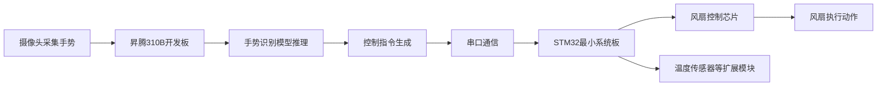

# 昇腾310B手势识别项目计划书

## 一、项目基本信息

| 项目名称 | 昇腾310B手势识别与STM32智能风扇控制系统 |
| --- | --- |
| 课程类型 | 华为昇腾课程设计 |
| 项目周期 | 2026年6月30日 - 2026年7月10日 |
| 项目成员 | 戴新宇 |
| 开发平台 | 昇腾310B开发板、STM32最小系统板 |
| 项目形式 | AI手势识别 + 嵌入式控制 + 外设联动 |

## 二、项目背景与意义

随着人工智能与嵌入式系统的发展，基于视觉识别的人机交互方式在智能家居、无接触控制、工业控制等场景中具有较高的应用价值。传统风扇控制方式通常依赖按键、遥控器或手机软件，交互方式相对固定；如果引入手势识别，就可以通过摄像头采集用户手势，并由AI开发板完成识别，再将识别结果传递给下位机进行设备控制，从而实现更加自然、直观的交互方式。

本项目以华为昇腾310B开发板为核心AI推理平台，结合老师提供的基础手势识别代码，在完成代码部署与测试的基础上，引入STM32最小系统板作为外设控制端，通过风扇、风扇控制芯片以及后续可扩展传感器，实现“手势识别 - 指令解析 - 风扇控制 - 状态反馈”的完整系统。项目既能体现昇腾AI开发板在视觉识别任务中的应用，也能体现STM32在实时控制和外设拓展方面的优势。

## 三、项目目标

1. 跑通老师提供的昇腾310B手势识别基础代码，完成开发环境配置、模型推理测试和识别结果输出验证。
2. 搭建STM32最小系统控制电路，实现对风扇的开关控制，并预留风速调节和传感器扩展接口。
3. 完成昇腾310B与STM32之间的通信设计，使AI识别结果能够转换为可执行的控制指令。
4. 在基础功能完成后进行功能升级，包括手势排列组合控制、更多控制动作定义以及温度传感器等外设创新扩展。
5. 最终形成一个能够演示的课程设计作品，并完成项目计划、开发记录、测试结果和总结材料。

## 四、需求分析

### 4.1 功能需求

- 摄像头采集手势图像或视频流。
- 昇腾310B开发板运行手势识别程序，识别常见静态或动态手势。
- 根据识别结果生成控制命令，例如风扇开启、关闭、切换档位或进入自动模式。
- STM32接收控制命令，并通过风扇控制芯片驱动风扇工作。
- 系统能够支持后续扩展，例如温度传感器检测环境温度，并与手势控制逻辑结合。

### 4.2 性能需求

- 手势识别结果能够稳定输出，基础演示过程中避免频繁误触发。
- 昇腾310B与STM32之间的通信过程应简单可靠，优先保证调试效率。
- 风扇控制响应应具备实时性，识别到有效手势后能够在较短时间内执行对应动作。
- 系统结构应便于现场展示，硬件连接清晰，软件模块职责明确。

### 4.3 非功能需求

- 项目成本可控，不计算昇腾开发板时，总体物料成本控制在约50元以内。
- 代码结构尽量清晰，方便后续调试、演示和答辩说明。
- 系统应具备一定安全性，风扇驱动部分避免直接由单片机IO口带载。
- 计划周期较短，因此优先完成可演示的核心闭环，再进行创新功能拓展。

## 五、总体设计方案

### 5.1 系统总体结构

本项目采用“上位AI识别 + 下位机控制”的系统架构。昇腾310B开发板负责手势识别与控制指令生成，STM32最小系统板负责外设驱动与传感器采集，两部分通过串口等方式进行通信。

### 5.2 工作流程

1. 摄像头采集用户手势画面，并将图像输入到昇腾310B开发板。
2. 昇腾310B运行老师提供的基础手势识别程序，完成模型加载、图像预处理、推理和结果解析。
3. 程序将识别结果映射为控制指令，例如`FAN_ON`、`FAN_OFF`、`SPEED_UP`、`SPEED_DOWN`、`AUTO_MODE`等。
4. 昇腾310B通过串口向STM32发送指令。
5. STM32解析指令，并通过风扇控制芯片驱动风扇执行对应动作。
6. 后续扩展阶段，STM32可读取温度传感器数据，并结合手势指令实现自动控制策略。

## 六、硬件设计

### 6.1 硬件组成

| 序号 | 物料名称 | 数量 | 作用 | 预估价格 |
| --- | --- | ---: | --- | ---: |
| 1 | STM32最小系统板 | 1块 | 负责接收指令、控制风扇和读取传感器 | 约20元 |
| 2 | 小型直流风扇 | 1个 | 作为被控执行设备 | 约10元 |
| 3 | 风扇控制芯片/驱动模块 | 1个 | 驱动风扇，保护单片机IO口 | 约10元 |
| 4 | 温度传感器模块等 | 1个 | 用于创新扩展，实现温度联动控制 | 约5-10元 |
| 5 | 杜邦线、面包板等辅助材料 | 若干 | 硬件连接与调试 | 约5元 |
| 6 | 昇腾310B开发板 | 1块 | AI手势识别与指令生成 | 课程提供/不计入成本 |

**成本说明：** 不计算昇腾310B开发板时，项目基础物料总成本预计约50元，符合低成本课程设计要求。

### 6.2 硬件连接思路

- 昇腾310B与STM32之间通过串口通信，昇腾端发送识别后的控制指令，STM32端负责接收和解析。
- STM32通过GPIO或PWM信号连接风扇控制芯片，实现风扇开关和后续可能的转速控制。
- 温度传感器接入STM32的GPIO、ADC或单总线接口，根据具体传感器型号确定连接方式。
- 风扇供电与控制信号分离，避免直接使用STM32 IO口驱动风扇，提升系统稳定性。

## 七、软件设计

### 7.1 昇腾310B端软件设计

昇腾310B端主要负责AI识别任务，软件工作包括环境部署、模型运行、识别结果解析和通信发送。

主要模块如下：

- **环境配置模块：** 配置昇腾开发环境，确认依赖库、模型文件和运行脚本可正常使用。
- **图像采集模块：** 获取摄像头输入或测试图片输入。
- **手势识别模块：** 运行老师提供的基础识别代码，得到手势类别结果。
- **指令映射模块：** 将识别到的手势转换为风扇控制指令。
- **串口发送模块：** 将控制指令发送给STM32。

### 7.2 STM32端软件设计

STM32端主要负责控制执行和传感器扩展，软件工作包括串口接收、命令解析、PWM/GPIO控制和传感器读取。

主要模块如下：

- **串口接收模块：** 接收昇腾310B发送的控制指令。
- **命令解析模块：** 判断指令类型并调用对应控制函数。
- **风扇控制模块：** 实现风扇开启、关闭和档位控制。
- **温度采集模块：** 读取温度传感器数据，为自动控制提供依据。
- **模式管理模块：** 支持手势控制模式和温度自动控制模式切换。

### 7.3 指令设计初稿

| 手势/组合动作 | 控制指令 | STM32执行效果 |
| --- | --- | --- |
| 张开手掌 | `FAN_ON` | 打开风扇 |
| 握拳 | `FAN_OFF` | 关闭风扇 |
| 向上手势 | `SPEED_UP` | 提高风扇档位 |
| 向下手势 | `SPEED_DOWN` | 降低风扇档位 |
| 连续两个指定手势 | `AUTO_MODE` | 进入温度自动控制模式 |
| 特定组合手势 | `MANUAL_MODE` | 返回手势手动控制模式 |

具体手势类别可根据老师提供代码的识别类别进行调整，优先保证已有模型可识别的手势与控制逻辑相匹配。

## 八、创新点设计

### 8.1 手势排列组合控制

在基础单一手势控制的基础上，加入手势组合逻辑。例如单个手势只负责基础动作，连续识别到多个手势后触发高级功能。这样可以减少误触发，也能提升项目展示效果。

可设计的组合方式包括：

- “张开手掌 + 向上手势”：开启风扇并提高档位。
- “握拳 + 向下手势”：降低档位并关闭风扇。
- “张开手掌 + 握拳 + 张开手掌”：切换自动温控模式。
- “向上 + 向下”组合：切换演示模式或重置状态。

### 8.2 STM32传感器联动控制

在STM32端加入温度传感器，实现手势控制与环境感知结合。用户可以通过手势切换自动模式，当温度高于设定阈值时风扇自动开启或提高档位，当温度较低时自动降低档位或关闭风扇。

该创新点能够体现嵌入式系统的实时控制能力，也能让项目从简单“识别后开关风扇”升级为“AI交互 + 环境感知 + 自动控制”的综合系统。

### 8.3 控制策略优化

为避免手势误识别导致风扇频繁变化，可加入简单的软件防抖策略，例如：

- 连续多帧识别结果一致时才确认手势有效。
- 相邻两次控制指令之间设置最短间隔。
- 对组合手势设置时间窗口，超时后自动清空缓存。

## 九、进度安排

| 时间 | 阶段任务 | 主要内容 | 阶段成果 |
| --- | --- | --- | --- |
| 6月30日 - 7月1日 | 昇腾开发板基础测试 | 配置环境，运行老师提供的手势识别代码，确认摄像头/图片输入和模型推理输出 | 老师代码能够在昇腾310B上正常运行 |
| 7月2日 - 7月4日 | STM32基础控制开发 | 搭建STM32最小系统，完成串口接收、风扇驱动和基础控制程序 | STM32能够根据指令控制风扇开关 |
| 7月5日 | 系统联调 | 连接昇腾310B与STM32，完成识别结果到风扇动作的闭环测试 | 实现手势识别控制风扇的基础功能 |
| 7月6日 - 7月8日 | 功能升级与创新 | 增加手势排列组合控制、温度传感器联动、自动/手动模式切换 | 完成创新功能演示版本 |
| 7月9日 | 测试与优化 | 测试识别稳定性、串口通信稳定性、风扇响应效果，完善防误触发逻辑 | 系统稳定性提升，演示流程明确 |
| 7月10日 | 文档整理与答辩准备 | 整理计划书、开发过程、测试结果、演示说明和总结 | 完成课程设计提交材料 |

## 十、测试计划

### 10.1 昇腾310B端测试

- 检查开发环境是否配置成功。
- 检查老师提供代码是否可以正常运行。
- 使用不同手势进行测试，记录识别类别和识别稳定性。
- 检查识别结果是否能够正确转换为控制指令。

### 10.2 STM32端测试

- 使用串口调试助手或昇腾开发板发送测试指令。
- 检查STM32是否能正确解析`FAN_ON`、`FAN_OFF`等指令。
- 检查风扇驱动电路是否能够稳定工作。
- 如果加入PWM控制，测试不同档位下风扇转速变化是否明显。

### 10.3 系统联调测试

- 测试从手势识别到风扇动作的完整链路。
- 测试连续手势、组合手势和错误手势下系统表现。
- 测试自动温控模式和手动手势模式之间的切换。
- 记录问题并根据实际结果优化阈值、防抖时间和控制逻辑。

## 十一、风险分析与解决措施

| 风险 | 可能影响 | 解决措施 |
| --- | --- | --- |
| 昇腾环境配置耗时较长 | 影响后续开发进度 | 前两天集中完成老师代码运行，优先保证基础识别可用 |
| 手势识别准确率不稳定 | 控制动作容易误触发 | 增加多帧确认、指令间隔和组合手势时间窗口 |
| 串口通信调试困难 | 昇腾与STM32无法联动 | 先用串口调试助手单独测试STM32，再接入昇腾端 |
| 风扇驱动电流不足 | 风扇无法稳定工作 | 使用风扇控制芯片或驱动模块，不直接使用IO口驱动 |
| 传感器扩展时间不足 | 创新功能完成度降低 | 先完成基础闭环，再将温度传感器作为可选增强功能 |

## 十二、预期成果

1. 完成基于昇腾310B开发板的手势识别代码运行与测试。
2. 完成STM32最小系统对风扇的基础控制功能。
3. 完成昇腾310B与STM32之间的通信联动，实现手势控制风扇。
4. 实现至少一种创新功能，例如手势组合控制或温度传感器自动控制。
5. 形成课程设计所需的项目计划书、演示流程、测试记录和总结说明。

## 十三、验收标准

- 能够在昇腾310B开发板上运行手势识别程序，并输出可用识别结果。
- 能够通过STM32控制风扇开启和关闭，具备基本外设控制能力。
- 能够完成“用户做出手势 - 昇腾识别 - STM32执行 - 风扇响应”的现场演示。
- 系统至少包含一个可说明的创新点，例如组合手势控制或温度传感器联动。
- 项目文档完整，能够说明设计思路、实现过程、物料成本、进度安排和测试结果。

## 十四、总结

本项目围绕华为昇腾310B开发板的手势识别能力展开，通过引入STM32最小系统板和风扇控制模块，将AI识别结果转化为真实外设动作。项目整体目标明确、硬件成本较低、演示效果直观，适合作为课程设计作品进行展示。在开发过程中，项目将优先完成老师提供代码的运行测试和基础风扇控制闭环，再逐步加入手势组合、温度传感器和自动控制等创新内容，最终形成一个兼具AI识别、嵌入式控制和智能交互特点的综合实践系统。
